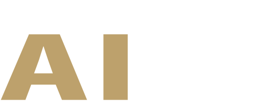

# 2026 董監事 AI 大講堂 - AI 助手使用指南

## 專案概述

本專案為「2026 董監事 AI 大講堂」的官方活動網頁，專為台灣上市櫃公司董監事與治理主管設計的 AI 治理必修課程。

### 活動資訊
- **主辦單位**：財團法人人工智慧學校基金會
- **協辦單位**：中華民國全國工業總會
- **活動日期**：2026.04.28（二）09:00-16:30
- **活動地點**：台北萬豪酒店 5F 萬豪廳（台北市中山區樂群二路199號）
- **活動費用**：每人 NT$ 6,600（含稅，提供午餐與茶點）
- **贊助方案**：治理夥伴 NT$ 250 萬元（含稅，限定 2-3 家金控集團）

## 網頁版本說明

### 🔴 重要：雙頁面架構

本專案包含**兩個獨立頁面**，所有修改必須同步套用到兩頁：

#### 📄 index.html（標準參與者版）
- **目標受眾**：董監事、治理主管、一般報名者
- **導航項目**：關於講堂、AIA影響力、講者陣容、講堂議程、完課證書、場地資訊
- **特點**：專注於課程內容與參與資訊

#### 📄 sponsor.html（贊助商版）
- **目標受眾**：潛在贊助企業、金控集團
- **導航項目**：關於講堂、AIA影響力、講者陣容、講堂議程、完課證書、**治理夥伴**、場地資訊
- **特點**：額外包含「治理夥伴」專區，詳細說明贊助方案

#### 兩版本的主要差異

| 特點 | index.html | sponsor.html |
|------|-----------|--------------|
| 導航列 | 6 個項目 | 7 個項目（多「治理夥伴」） |
| Partners Section | ❌ 無 | ✅ 有（第 754-816 行） |
| 贊助資訊呈現 | CTA 區簡述 | 獨立專區詳細展示 |
| Google Analytics | 標準事件追蹤 | 額外追蹤贊助頁面互動 |

### ⚠️ 修改原則

**所有內容更新（講師、議程、活動資訊等）必須同步修改兩個頁面**，除非是以下特定區塊：
- 導航列中的「治理夥伴」連結（僅 sponsor.html）
- Partners Section（僅 sponsor.html）
- 特定 Google Analytics 事件標籤

## 專案結構

```
2026-ceo-ai-masterclass/
├── index.html             # 主要頁面（標準參與者版）
├── sponsor.html           # 贊助商版頁面（含治理夥伴區塊）
├── class_data.txt         # 課程資料
├── prompt.txt             # 提示詞檔案
├── package.json           # 專案配置
├── assets/                # 資源檔案
│   ├── AIA-logo-white.svg       # 台灣人工智慧學校 Logo
│   ├── CXO-LOGO.svg             # 主視覺 Logo
│   ├── 1-chen.jpeg              # 講師：陳伶志
│   ├── 2-lien.jpg               # 講師：連賢明
│   ├── 3-yu.jpg                 # 講師：余孝先
│   ├── 4-lee.jpg                # 講師：李家岩
│   ├── 5-tsai.png               # 課程總結：蔡明順
│   ├── certificate_resized.png  # 完課證書範本
│   ├── wd-.jpg                  # AIA 年會照片 / 治理夥伴視覺
│   └── preview3.png             # Open Graph 預覽圖
└── AGENTS.md              # 本檔案（AI 助手指南）
```

## 技術架構

### 前端技術
- **HTML5**：語義化標記
- **Tailwind CSS**：透過 CDN 引入，用於樣式設計
- **Font Awesome 6.4.0**：圖示庫
- **Google Fonts**：
  - Noto Sans TC（繁體中文內容）
  - Playfair Display（數字與標題）

### 設計系統

#### 色彩配置
- **Obsidian（黑曜石）**：`#050b14` - 主背景、深色文字
- **Deep Blue（深藍）**：`#1e3a8a` - 次要背景、漸層元素
- **Tech Blue / Prestige Gold（科技藍/尊貴金）**：`#bda16c` - 品牌主色、前景色、強調色
- **Noble Gold（高貴金）**：`#bda16c` - 金色變體
- **Prestige Gold Hover**：`#a8905a` - 懸停狀態（較深）
- **Light Gray**：`#f8fafc` - 淺色文字
- **Glass**：`rgba(255, 255, 255, 0.05)` - 玻璃態背景
- **Glass Border**：`rgba(255, 255, 255, 0.1)` - 玻璃態邊框

#### 背景漸層系統
```css
/* Body 背景 */
background: radial-gradient(circle at center, 
  #1e3a8a 0%,      /* Deep Blue */
  #0a1528 50%,     /* 中間色 */
  #050b14 100%     /* Obsidian */
);
```

#### 設計風格
- **玻璃態效果（Glassmorphism）**：
  - `backdrop-filter: blur(12px)` 實現模糊背景
  - 半透明背景 `rgba(10, 30, 61, 0.4)`
  - 白色透明邊框 `rgba(255, 255, 255, 0.1)`
  - 陰影效果 `0 4px 30px rgba(0, 0, 0, 0.5)`

- **漸層文字**：
  - 金色漸層：`linear-gradient(to right, #bda16c, #d4b88a, #bda16c)`
  - 金白漸層：`linear-gradient(to right, #bda16c, #ffffff)`
  - Shine 動畫：5 秒循環

- **Canvas 動畫**：
  - Hero 區：60 條波浪線，垂直分布全屏
  - CTA 區：22 條波浪線，集中於中央
  - 使用金色漸層 `rgba(189, 161, 108, *)` 和 `rgba(212, 184, 138, *)`

- **淡入動畫**：
  - 使用 Intersection Observer 實現滾動觸發
  - `.fade-up` 類別：`opacity: 0; transform: translateY(30px)`
  - 可見時：`opacity: 1; transform: translateY(0)`
  - 過渡效果：0.8 秒 ease-out

- **懸停效果（Card Hover）**：
  - 邊框變金色：`rgba(189, 161, 108, 0.8)`
  - 向上移動：`translateY(-14px)`
  - 背景加深：`rgba(10, 30, 61, 0.7)`
  - 陰影增強：`0 20px 60px rgba(189, 161, 108, 0.3)`

## 頁面區塊說明

**⚠️ 以下區塊存在於 index.html 和 sponsor.html（除非特別標註）**

### 1. 導航列（Navigation）
- **位置**：固定於頁面頂部（`fixed top-0 z-50`）
- **Logo**：`assets/AIA-logo-white.svg`（台灣人工智慧學校）
- **導航連結**：
  - **共同項目**（兩版本都有）：關於講堂、AIA影響力、講者陣容、講堂議程、完課證書、場地資訊
  - **sponsor.html 獨有**：治理夥伴（#partners）
- **行動按鈕**：立即預約席次（連結至 https://neti.cc/3xqq9o3）
- **行動選單**：< 768px 時顯示漢堡選單
- **樣式**：玻璃態效果，滾動後變為漸層背景

### 2. 英雄區塊（Hero Section）
- **背景動畫**：Canvas 波浪線動畫（60 條線）
- **漸層覆蓋**：徑向漸層從深藍到黑曜石
- **主視覺 Logo**：`assets/CXO-LOGO.svg`（全寬，最大 7xl）
- **副標題**：「2026 AI Masterclass for Board Members」
- **重點文字**：「上市櫃公司董監事治理主管 AI 必修課 唯一選擇」
- **主辦資訊**：財團法人人工智慧學校基金會、中華民國全國工業總會
- **資訊卡片**：
  - 日期：2026.04.28（二）09:00-16:30
  - 地點：台北萬豪酒店 5F 萬豪廳
- **向下箭頭**：跳動動畫

### 3. 關於講堂（About Section）
- **標題**：「AI 不只是技術革新，更是企業治理的新挑戰」
- **內容**：說明課程宗旨、AI 治理重要性、董監進修時數認證

### 4. AIA 影響力（Impact Stats Section）
- **數字統計**（含計數動畫）：
  - 8 次年會
  - 1,466 訓練企業數
  - 12,968 學員人數
  - 498 講師人數
- **年會照片**：`assets/wd-.jpg`
- **圖示**：Font Awesome icons（行事曆、建築、畢業生、教師）

### 5. 講者陣容（Speakers Section）
- **四位主講者**（2x2 網格，響應式）：
  1. **陳伶志**：台灣人工智慧學校 執行長 / 中央研究院資訊服務處處長
     - 標籤：治理/風險
     - 主題：全球 AI 治理新標準
  2. **連賢明**：中華經濟研究院 院長 / 政大財政學系 特聘教授
     - 標籤：趨勢/經濟
     - 主題：AI 時代的台灣經濟
  3. **余孝先**：清華大學科技管理學院 兼任教授
     - 標籤：機會/技術
     - 主題：董監事對 AI 應有的認知
  4. **李家岩**：臺灣大學管理學院 副院長暨 EiMBA 執行長
     - 標籤：決策/數據
     - 主題：數據驅動的決策革新
- **課程總結**：蔡明順（台灣人工智慧學校 校務長）
- **互動功能**：點擊講師卡片開啟 Modal 顯示完整簡歷
- **懸停效果**：卡片上移、邊框變金色、陰影增強、照片放大

### 6. 講堂議程（Agenda Section）
- **時間軸設計**：垂直卡片式排列
- **主要時段**：
  - 08:30-09:00：報到（5F 萬豪廳）
  - 09:00-09:20：主辦致詞（陳伶志）/ 貴賓致詞（李愛玲 總經理）
  - 09:20-10:50：**陳伶志** - 全球 AI 治理新標準
  - 10:50-11:10：Coffee Break
  - 11:10-12:40：**連賢明** - AI 時代的台灣經濟
  - 12:40-14:00：Lunch Time（3F 博覽廳）
  - 14:00-15:30：**余孝先** - 董監事對 AI 應有的認知
  - 15:30-15:50：Coffee Break
  - 15:50-16:20：**李家岩** - 數據驅動的決策革新
  - 16:20-16:30：課程總結（蔡明順）
  - 16:30-：證書領取
- **重點課程樣式**：金色邊框、漸層背景、詳細大綱

### 7. 完課證書（Certificate Section）
- **證書圖片**：`assets/certificate_resized.png`
- **認證說明**：董監事/公司治理主管進修時數認證
- **時數登錄**：全程參與者頒發證書，供向證交所或櫃買中心申報
- **互動功能**：桌面版點擊圖片開啟放大 Modal

### 8. 治理夥伴（Partners Section）**【僅 sponsor.html】**
- **位置**：Certificate 與 Venue 之間
- **視覺設計**：左右分欄（圖片 + 內容）
- **主視覺**：`assets/wd-.jpg`
- **贊助方案內容**：
  - **夥伴權益**：品牌曝光、專屬邀請名額 200 位、VIP 接待等
  - **贊助名額**：限定 2-3 家金控集團
  - **贊助金額**：新台幣 250 萬元（含稅）
- **聯絡資訊**：02-8512-3731*12 康小姐
- **樣式**：玻璃態卡片、金色項目符號、懸停動畫

### 9. 場地資訊（Venue Section）
- **左欄：場地資訊**
  - 台北萬豪酒店 5F 萬豪廳
  - 地址：台北市中山區樂群二路199號
  - 交通資訊：捷運劍南路站、公車路線（A/B/C 三站）
  - 住宿優惠：4/27 有住房需求學員特惠方案
- **右欄：Google 地圖**
  - 嵌入式 iframe
  - 尺寸：432px 高度

### 10. 報名行動區（CTA Section）
- **背景動畫**：Canvas 波浪線動畫（22 條線）
- **主標題**：「Empower Your Boards with AI Governance」
- **招生資訊**：
  - **對象**：台灣上市櫃公司董事、監察人；企業公司治理主管
  - **學費**：每人 6,600 元含稅（提供午餐與茶點）
  - **團體方案**：請洽詢台灣人工智慧學校 02-8512-3731*12 康小姐
- **行動按鈕**：立即預約席次（金色按鈕、發光效果）

### 11. 浮動 CTA 按鈕（Floating CTA）
- **位置**：固定於右側中央（`fixed right: 0; top: 50%`）
- **文字方向**：垂直書寫（`writing-mode: vertical-rl`）
- **文字**：「立即預約席次」
- **樣式**：玻璃態、金色文字、邊框圓角
- **互動**：懸停時不透明度增加、陰影增強
- **響應式**：< 768px 時隱藏

### 12. 頁尾（Footer）
- **版權資訊**：© 2026 Taiwan AI Academy. All Rights Reserved.
- **樣式**：黑色背景、灰色文字

### 13. 互動 Modal

#### 講者 Modal（Speaker Modal）
- **觸發**：點擊講師卡片
- **內容**：講師照片、姓名、職稱、完整簡歷
- **關閉**：點擊背景、按鈕、或按 ESC 鍵

#### 證書 Modal（Certificate Modal）
- **觸發**：桌面版點擊證書圖片
- **內容**：證書放大圖
- **限制**：行動版（< 768px）停用
- **關閉**：點擊背景、按鈕、或按 ESC 鍵

## 資源檔案規格

### Logo 檔案

#### AIA Logo（導航列）
- **檔案**：`assets/AIA-logo-white.svg`
- **格式**：SVG 向量圖
- **顏色**：白色（適用於深色背景）
- **顯示尺寸**：`h-14`（56px 高度）
- **使用位置**：導航列左側

#### 主視覺 Logo（Hero）
- **檔案**：`assets/CXO-LOGO.svg`
- **格式**：SVG 向量圖
- **顯示尺寸**：全寬，最大 `max-w-7xl`
- **使用位置**：Hero Section 中央
- **效果**：`drop-shadow-2xl`

### 講師照片規格

#### 檔案清單
1. `assets/1-chen.jpeg` - 陳伶志
2. `assets/2-lien.jpg` - 連賢明
3. `assets/3-yu.jpg` - 余孝先
4. `assets/4-lee.jpg` - 李家岩
5. `assets/5-tsai.png` - 蔡明順（課程總結）

#### 顯示規格
- **講師卡片照片**：
  - 容器：`aspect-square`（1:1 正方形）
  - 樣式：`object-cover`（裁切填滿）
  - 懸停效果：`scale-115`（放大 15%）
  
- **Modal 照片**：
  - 尺寸：`w-32 h-32`（行動）/ `w-40 h-40`（桌面）
  - 樣式：圓形、金色邊框 `border-2 border-prestigeGold/30`

- **課程總結講師**：
  - 尺寸：`w-28 h-28`（112px × 112px）
  - 樣式：圓形、金色邊框

#### 建議規格
- **原始尺寸**：至少 800px × 800px
- **檔案格式**：JPEG / PNG
- **色彩模式**：RGB
- **檔案大小**：< 500KB（已優化）
- **寬高比**：1:1（正方形）或可裁切為正方形

### 其他圖片資源

#### 證書範本
- **檔案**：`assets/certificate_resized.png`
- **用途**：完課證書預覽
- **顯示位置**：Certificate Section、Certificate Modal
- **建議尺寸**：1200px 寬度（橫向）
- **檔案大小**：< 300KB

#### AIA 年會照片 / 治理夥伴視覺
- **檔案**：`assets/wd-.jpg`
- **用途**：
  1. Impact Section - AIA 年會盛況
  2. Partners Section - 治理夥伴贊助方案視覺
- **顯示樣式**：`object-cover`（覆蓋式裁切）
- **建議尺寸**：1920px 寬度
- **檔案大小**：< 500KB

#### Open Graph 預覽圖
- **檔案**：`assets/preview3.png`
- **用途**：社群媒體分享預覽
- **標準尺寸**：1200px × 630px
- **使用位置**：`<meta property="og:image">`

## 開發與維護指南

### 本地開發
```bash
# 使用 Python 簡易伺服器
python -m http.server 8000

# 或使用 Node.js http-server
npx http-server -p 8000

# 瀏覽器開啟
# http://localhost:8000/index.html
# http://localhost:8000/sponsor.html
```

### 修改工作流程

#### ⚠️ 雙頁面同步修改原則

**所有內容更新必須同時修改 `index.html` 和 `sponsor.html`**，包括：
- 講師資訊（姓名、職稱、簡歷）
- 議程時間與內容
- 活動資訊（日期、地點、費用）
- 講堂標題與說明文字
- Logo 與圖片資源
- 樣式調整（CSS、Tailwind 配置）

**僅需修改 `sponsor.html` 的情況**：
- Partners Section 內容（贊助方案細節）
- 導航列中的「治理夥伴」連結
- 特定 Google Analytics 事件標籤

### 常見修改任務

#### 1. 更新講師資訊

**步驟**：
1. 準備講師照片，放置於 `assets/` 目錄
2. 在兩個 HTML 檔案中找到 Speakers Section
3. 更新講師卡片 HTML（姓名、職稱、照片路徑、標籤）
4. 更新 JavaScript 中的 `speakerData` 物件（完整簡歷）
5. 確認 Modal 功能正常運作

**位置**：
- 講師卡片：約第 413-478 行
- JavaScript 資料：約第 1070-1101 行

#### 2. 更新議程時間

**步驟**：
1. 在 Agenda Section 找到對應時段卡片
2. 修改時間、標題、講者、大綱內容
3. 確認重點課程有金色邊框樣式
4. 兩個檔案同步修改

**位置**：約第 523-717 行

#### 3. 更新活動資訊

**需修改位置**：
- Hero Section 資訊卡片（約第 294-306 行）
- CTA Section 招生對象與學費（約第 882-906 行）
- Meta 標籤描述（約第 7 行）

#### 4. 更新贊助方案（僅 sponsor.html）

**位置**：Partners Section（約第 754-816 行）

**可修改內容**：
- 贊助金額
- 夥伴權益說明
- 名額限制
- 聯絡資訊

#### 5. 更新 Logo

**導航列 Logo**：
```html
<!-- 約第 224 行 -->

```

**主視覺 Logo**：
```html
<!-- 約第 278 行 -->

```

#### 6. 調整色彩配置

**位置**：約第 44-69 行

```javascript
tailwind.config = {
    theme: {
        extend: {
            colors: {
                obsidian: '#050b14',
                deepBlue: '#1e3a8a',
                techBlue: '#bda16c',
                prestigeGold: '#bda16c',
                // ... 其他顏色
            }
        }
    }
}
```

#### 7. 修改自訂 CSS

**位置**：`<style>` 標籤內（約第 71-214 行）

**常見調整**：
- 玻璃態效果透明度
- 懸停動畫參數
- 滾動條顏色
- 漸層配置

### 測試檢查清單

修改後請確認：

- [ ] 兩個頁面（index.html 和 sponsor.html）都已同步修改
- [ ] 所有圖片資源路徑正確
- [ ] 響應式設計在不同螢幕尺寸正常
- [ ] 講師 Modal 功能正常
- [ ] 證書 Modal 功能正常（桌面版）
- [ ] 行動選單正常運作
- [ ] 平滑滾動錨點連結正常
- [ ] Google Analytics 追蹤碼正確
- [ ] Canvas 動畫正常顯示
- [ ] 所有外部連結（報名連結）正確

### 瀏覽器相容性

**支援瀏覽器**：
- Chrome / Edge 88+
- Firefox 85+
- Safari 14+
- 行動版 Safari / Chrome

**關鍵 CSS 特性**：
- `backdrop-filter`：玻璃態效果（需檢查瀏覽器支援）
- `writing-mode: vertical-rl`：浮動 CTA 按鈕
- CSS Grid & Flexbox：版面配置
- CSS 自訂屬性：色彩系統

**JavaScript 依賴**：
- Intersection Observer API：滾動動畫
- Canvas API：背景動畫
- ES6+ 語法：箭頭函式、模板字串

### 效能優化建議

1. **圖片優化**：
   - 使用 WebP 格式（提供 fallback）
   - 壓縮 JPEG/PNG（TinyPNG、ImageOptim）
   - SVG 檔案移除不必要的元數據

2. **載入優化**：
   - Google Fonts 使用 `preconnect`
   - 圖片使用 `loading="lazy"`（除首屏圖片）
   - 考慮使用 CDN

3. **Canvas 動畫**：
   - 行動裝置減少粒子/線條數量
   - 使用 `requestAnimationFrame`
   - 考慮在低效能裝置上停用動畫

## 技術架構詳細說明

### JavaScript 功能模組

#### 1. 平滑滾動（Smooth Scroll）
```javascript
// 錨點連結平滑滾動
document.querySelectorAll('a[href^="#"]').forEach(anchor => {
    anchor.addEventListener('click', function (e) {
        e.preventDefault();
        document.querySelector(this.getAttribute('href')).scrollIntoView({
            behavior: 'smooth'
        });
    });
});
```

#### 2. 滾動觸發動畫（Intersection Observer）
- 監控 `.fade-up` 元素
- 進入視窗時加上 `.visible` 類別
- 閾值：10%（`threshold: 0.1`）

#### 3. Canvas 動畫

**Hero 波浪動畫**：
- 60 條波浪線
- 垂直分布全屏高度
- 波速：0.0075
- 振幅：100px

**CTA 波浪動畫**：
- 22 條波浪線
- 集中於區域中央
- 波速：0.008
- 振幅：60px

#### 4. 數字計數動畫（Impact Stats）
- 使用 Intersection Observer 觸發
- 0.8 秒動畫時間
- 60 FPS 更新頻率
- 逐一延遲 100ms 啟動

#### 5. Modal 系統

**講者 Modal**：
- `openSpeakerModal(speakerId)`
- `closeSpeakerModal(event)`
- 支援 ESC 鍵關閉
- 點擊背景關閉

**證書 Modal**：
- `openCertificateModal()`
- `closeCertificateModal(event)`
- 桌面版限定（< 768px 停用）

#### 6. 導航列效果
- 滾動 > 50px 時背景變為漸層
- 滾動 ≤ 50px 時恢復玻璃態

#### 7. 行動選單
- Toggle 顯示/隱藏
- 點擊連結後自動關閉

### Google Analytics 追蹤

**追蹤碼**：`G-B6862W9FBG`

**事件追蹤**：
- `click_registration` - 點擊報名按鈕
  - `navbar_cta` - 導航列 CTA
  - `mobile_menu_cta` - 行動選單 CTA
  - `section_cta` - CTA Section 按鈕
  - `floating_cta` - 浮動按鈕（index.html）
  - `sponsor_floating_cta` - 浮動按鈕（sponsor.html）

### 報名連結

**統一連結**：`https://neti.cc/3xqq9o3`

**使用位置**：
1. 導航列按鈕
2. 行動選單按鈕
3. CTA Section 主按鈕
4. 浮動 CTA 按鈕

## SEO 與社群分享

### Meta 標籤
```html
<title>2026 董監事 AI 大講堂 | CEO AI Masterclass</title>
<meta name="description" content="台灣上市櫃公司董監事與高階主管 AI 治理必修課程。由台灣人工智慧學校主辦，邀集權威師資，探討 AI 治理新標準、經濟趨勢與數據決策，協助企業掌握 AI 時代的關鍵競爭力。">
```

### Open Graph
- **類型**：website
- **網址**：https://cxo2026.aiacademy.tw/
- **標題**：2026 董監事 AI 大講堂 | CEO AI Masterclass
- **描述**：（同 meta description）
- **圖片**：https://cxo2026.aiacademy.tw/assets/preview3.png

### Twitter Card
- **類型**：summary_large_image
- **內容**：同 Open Graph

## 常見問題排查

### 問題 1：Canvas 動畫不顯示
**可能原因**：
- Canvas 元素未正確初始化
- 父容器尺寸為 0
- JavaScript 執行順序問題

**解決方法**：
- 檢查 `getElementById` 是否正確
- 確認 DOM 載入完成後才執行
- 檢查 `setTimeout` 延遲（100ms）

### 問題 2：Modal 無法關閉
**可能原因**：
- 事件冒泡被阻止
- `event.stopPropagation()` 位置錯誤

**解決方法**：
- 確認 Modal 內層有 `onclick="event.stopPropagation()"`
- 測試 ESC 鍵關閉功能

### 問題 3：響應式設計異常
**可能原因**：
- Tailwind 斷點設定錯誤
- CSS 覆寫優先級問題

**解決方法**：
- 檢查 Tailwind 響應式前綴（sm:, md:, lg:, xl:）
- 使用瀏覽器開發者工具檢查 CSS 套用狀況

### 問題 4：圖片無法載入
**可能原因**：
- 路徑錯誤
- 檔案不存在

**解決方法**：
- 確認 `assets/` 目錄結構
- 檢查檔案名稱大小寫（區分大小寫）
- 使用相對路徑 `assets/xxx.jpg`

## 部署注意事項

### 上線前檢查清單
- [ ] 所有圖片已優化並上傳
- [ ] Google Analytics 追蹤碼正確
- [ ] 所有外部連結已測試
- [ ] 報名連結正確且有效
- [ ] Meta 標籤與 Open Graph 資訊完整
- [ ] 兩個頁面（index.html & sponsor.html）都已更新
- [ ] 響應式設計在各裝置測試通過
- [ ] 瀏覽器相容性測試完成
- [ ] 無障礙檢查（alt 屬性、語意標籤）

### 建議目錄結構（部署後）
```
public/
├── index.html
├── sponsor.html
└── assets/
    ├── *.svg
    ├── *.jpg
    ├── *.jpeg
    └── *.png
```

### CDN 資源
- Tailwind CSS：`https://cdn.tailwindcss.com`
- Font Awesome：`https://cdnjs.cloudflare.com/ajax/libs/font-awesome/6.4.0/css/all.min.css`
- Google Fonts：`https://fonts.googleapis.com/css2?family=Noto+Sans+TC:wght@300;400;500;700&family=Playfair+Display:ital,wght@0,600;1,600&display=swap`

## 聯絡資訊

### 活動諮詢
- **電話**：02-8512-3731 分機 12
- **聯絡人**：康小姐
- **主辦單位**：財團法人人工智慧學校基金會

### 技術支援
如有開發或技術問題，請參考本文件或聯絡專案維護者。

---

**最後更新**：2026.01.28
**專案版本**：2.0.0
**維護者**：台灣人工智慧學校
